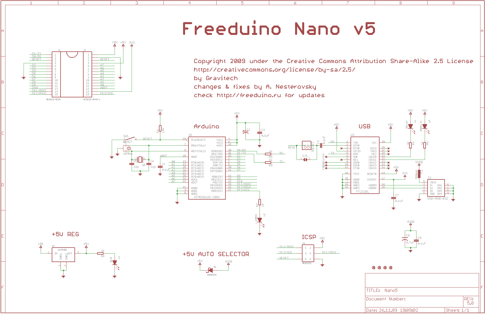
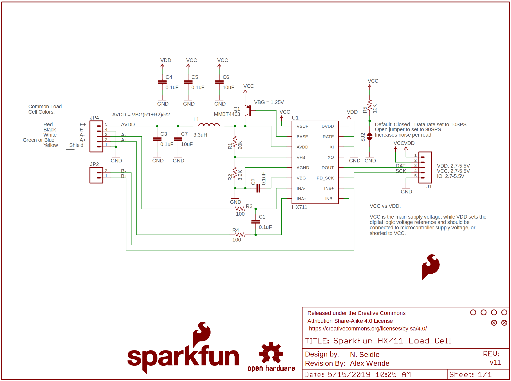
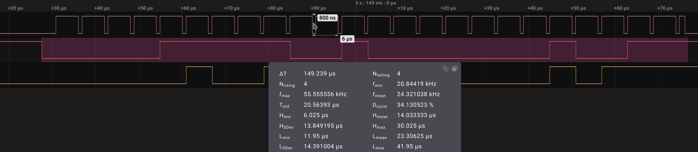

# EPM FMR strain gauge digitizer firmware

This directory contains the sources of a simple firmware for the EPM force measurement rig (FMR) strain gauge digitizer
that runs on an ATmega328P connected to dedicated strain gauge ADCs.
The firmware samples the ADCs simultaneously at their maximum rate (about 10 Hz)
and reports each sample to the PC via serial port using a custom simple binary fixed-size-frame format
(refer to `main.c` for the details).
The serial port is configured at **38400-8N1**.
Each frame contains the following information:

- A magic value for start-of-frame and protocol version detection.
- A 64-bit sequence number that never overflows for data loss detection and digitizer restart detection.
- Raw ADC counts per ADC as `int32_t`.
- A few bytes of opaque calibration data in an application-specific format.

## Calibration data

The sensor calibration data is read from the non-volatile memory when the device is started.
The application can store arbitrary information there.
One obvious way to use it is to store a tuple of gain + offset per ADC channel.

The calibration data can be written by sending an appropriately formatted data packet;
please consult with the sources for the details.
Once the packet is received,
the non-volatile memory is rewritten and the following readings will be sent with the new data
(no restart needed).
The user can check whether the calibration data is replaced by waiting for the next packet.

## Hardware configuration

The MCU is expected to be installed on Arduino Nano or some compatible PCB.
The MCU should have the built-in Arduino bootloader, which is accessed via AVRDUDE.

The strain gauges are connected via HX711 -- dedicated 24-bit Wheatstone bridge ADCs with SPI-like interface.

The connections are as follows:

- PD2 -- shared clock signal SCK connected to all HX711 at once.
- PD3 -- DO of the load cell #0.
- PD4 -- DO of the load cell #1.
- more load cells may be added following this pattern.

Example of reading data from two HX711 using a shared clock signal:

## Development

Use `make` to build, `make dude` to upload to the board (using the built-in Arduino bootloader),
`make format` to invoke Clang-Tidy for autoformatting.
